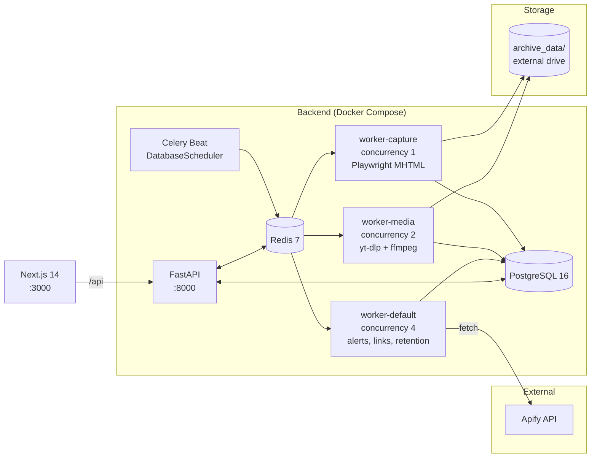

# social-monitor

> Self-hosted social-media archiving and monitoring for Twitter/X, Instagram, Facebook, TikTok, and YouTube.


A complete pipeline for **archiving public social-media posts at scale**: polls accounts via the [Apify](https://apify.com) scraping API, captures full-page MHTML + screenshots + original media, deduplicates by content hash, and surfaces everything through a Next.js dashboard with search, alerting, topic sets, retention policies, and an audit log.

Built for researchers, journalists, OSINT teams, brand-monitoring use cases, and anyone who needs an immutable, locally-controlled record of public posts.

---

## Table of contents

- [Screenshots](#screenshots)
- [Features](#features)
- [Supported platforms](#supported-platforms)
- [Architecture](#architecture)
- [Tech stack](#tech-stack)
- [Quick start](#quick-start)
- [Configuration](#configuration)
- [Common commands](#common-commands)
- [Project structure](#project-structure)
- [Adding a new platform](#adding-a-new-platform)
- [Production notes](#production-notes)
- [Troubleshooting](#troubleshooting)
- [Contributing](#contributing)
- [License](#license)

---

## Screenshots

<!-- TODO: drop UI screenshots into docs/images/ and link them here -->

| Dashboard / Review Queue | Post timeline |
| :---: | :---: |
| _coming soon_ | _coming soon_ |

| Alerts | Topic sets |
| :---: | :---: |
| _coming soon_ | _coming soon_ |

---

## Features

**Ingestion**
- Per-source polling intervals stored in the database (not a cron file) — update a row to change cadence
- Five platforms via Apify with platform-specific normalizers
- Concurrent ingestion runs (configurable cap) with full run history

**Capture & integrity**
- Full-page MHTML snapshots via headless Playwright/chromium
- PNG screenshots of every post
- Original media (images, videos) downloaded via yt-dlp + ffmpeg
- SHA-256 content hashing with deduplication

**Search & discovery**
- PostgreSQL full-text search (Spanish + English indexes)
- Topic sets (tags / collections) with arbitrary membership
- Rich filters, keyboard navigation, and pagination in the UI

**Alerts**
- Pattern-match rules on incoming posts
- Every firing recorded as an `AlertEvent`

**Operations**
- Retention policies with disk-usage snapshots
- Full audit log of mutations
- Profile snapshots tracking account state over time
- Link expansion (resolves shortened URLs)

---

## Supported platforms

| Platform | Apify actor | Notes |
| --- | --- | --- |
| Twitter / X | `apidojo/tweet-scraper` | Pagination limits apply |
| Instagram | `apify/instagram-scraper` | Carousel posts split into media items |
| Facebook | `apify/facebook-posts-scraper` | Reaction breakdown preserved |
| TikTok | `clockworks/free-tiktok-scraper` | Mixed Unix / ISO timestamps normalized |
| YouTube | `streamers/youtube-scraper` | Subtitle languages preserved |

Full Apify response shapes and normalizer field mappings are documented in [docs/apify-output-schemas.md](docs/apify-output-schemas.md).

---

## Architecture



Three specialized Celery queues isolate workloads with very different resource profiles: the default queue stays responsive, media downloads can be CPU- and disk-heavy, and browser-automation captures need a hard concurrency cap so chromium instances don't pile up.

---

## Tech stack

| Layer | Tech |
| --- | --- |
| API | FastAPI 0.115, Pydantic 2, async SQLAlchemy 2.0 (asyncpg) |
| Workers | Celery 5.4, Redis 7, Playwright (chromium), yt-dlp, ffmpeg |
| Scheduler | Custom `DatabaseScheduler` (reads `sources.poll_interval` from DB) |
| Database | PostgreSQL 16, Alembic migrations, UUID PKs, JSONB engagement data |
| Frontend | Next.js 14 (App Router), React 18, TypeScript, Tailwind 3.4, SWR, Radix UI, Lucide icons |
| Ingestion source | Apify |
| Container runtime | Docker Compose |

---

## Quick start

### Prerequisites

- **Docker Desktop** or Docker Engine + Compose v2
- **Apify account** with an API token — sign up at [apify.com](https://apify.com), then grab your token from [console.apify.com/account/integrations](https://console.apify.com/account/integrations)
- **~50 GB+ free disk** for the archive (videos add up fast — point `ARCHIVE_HOST_PATH` at an external drive if you're tight on space)
- **Ports `3000`, `5432`, `6379`, `8000`** available locally

### One-command setup

```bash
git clone https://github.com/bhngyn/social-monitor.git
cd social-monitor
./setup.sh
```

`setup.sh` will:
1. Verify Docker is available
2. Copy `.env.example` → `.env` and prompt you for `APIFY_API_TOKEN` and `ARCHIVE_HOST_PATH`
3. Create the archive directory on the host
4. Build and start all containers (`docker compose up --build -d`)
5. Wait for PostgreSQL to be ready
6. Run `alembic upgrade head`

When it finishes:
- Frontend → http://localhost:3000
- API docs → http://localhost:8000/docs

### Manual setup

```bash
cp .env.example .env        # then edit .env
make setup                  # build, start, migrate
```

### First source

Once the app is running, open http://localhost:3000, go to **Sources**, and add an account (platform + username/handle). Celery Beat will pick it up on the next tick using the source's `poll_interval`.

---

## Configuration

All configuration is environment-driven via `.env`. The full template is in [`.env.example`](.env.example).

### Required

| Variable | Description |
| --- | --- |
| `APIFY_API_TOKEN` | Your Apify API token. Without this, no scraping happens. |
| `ARCHIVE_HOST_PATH` | Host path mounted into containers at `/data/archive`. Use an external drive for production (`/Volumes/...` on macOS, `/mnt/...` on Linux). |
| `POSTGRES_USER`, `POSTGRES_PASSWORD`, `POSTGRES_DB` | Database credentials. **Change the password before exposing anywhere beyond localhost.** |
| `DATABASE_URL` | Async SQLAlchemy DSN — must use the `postgresql+asyncpg://` driver. |
| `REDIS_URL` | Redis connection string (broker + result backend for Celery). |

### Tunable

| Variable | Default | Description |
| --- | --- | --- |
| `MAX_CONCURRENT_INGESTIONS` | `3` | Cap on simultaneous ingestion runs across all sources. |
| `DEFAULT_POLL_INTERVAL` | `3600` | Default seconds between polls for new sources (per-source overrides live in the DB). |
| `MAX_VIDEO_FILESIZE` | `524288000` | Max video size in bytes (500 MB). Larger videos are skipped. |
| `MAX_VIDEO_DURATION` | `0` | Max video duration in seconds. `0` = no limit. |
| `MAX_VIDEO_RESOLUTION` | `best` | One of `720`, `1080`, or `best`. |

### Resource limits (per Docker service)

| Variable | Default | Applies to |
| --- | --- | --- |
| `API_CPU_LIMIT` / `API_MEMORY_LIMIT` | `1.0` / `1G` | `api` |
| `WORKER_CPU_LIMIT` / `WORKER_MEMORY_LIMIT` | `2.0` / `4G` | `worker-default` (other workers have fixed limits in `docker-compose.yml`) |

### Internal (rarely changed)

| Variable | Default | Description |
| --- | --- | --- |
| `NEXT_PUBLIC_API_URL` | `http://localhost:8000` | Browser-side API URL exposed to the Next.js client. |
| `API_INTERNAL_URL` | `http://api:8000` | Server-side API URL used by Next.js inside the Docker network. |

---

## Common commands

All commands are wrapped in the Makefile.

| Command | What it does |
| --- | --- |
| `make setup` | Build images, start everything, wait for DB, run migrations. First-time use. |
| `make update` | `git pull`, rebuild, restart, migrate. |
| `make start` / `make stop` / `make restart` | Lifecycle commands. |
| `make status` | `docker compose ps`. |
| `make logs` | Tail logs for all services. |
| `make logs-api` / `make logs-worker` | Tail logs for one service. |
| `make shell-api` | Bash shell inside the `api` container. |
| `make shell-db` | `psql` inside the `db` container. |
| `make migrate` | Apply pending Alembic migrations. |
| `make migration msg="add foo column"` | Autogenerate a new migration. |
| `make seed` | Seed the DB with initial data (`python -m app.seed`). |
| `make reset-db` | **Destructive.** Drop volumes and re-run `setup`. |
| `make clean` | Remove containers, volumes, and locally built images. |

---

## Project structure

```
backend/
  app/
    main.py              # FastAPI entrypoint, CORS, lifespan hooks
    config.py            # Pydantic Settings (env-driven)
    database.py          # async engine + session factory
    api/                 # routers: sources, posts, notes, sets, alerts,
                         #          timeline, ingest, audit, files, storage, export, health
    models/              # SQLAlchemy ORM
    schemas/             # Pydantic mirrors of models/
    services/normalizers/  # twitter / instagram / facebook / tiktok / youtube → unified Post
    worker/
      celery_app.py
      scheduler.py       # custom DatabaseScheduler
      tasks/             # ingest, apify_fetch, capture, media_download,
                         #   link_expansion, hashing, profile_snapshot, retention, alerts
  alembic/versions/      # database migrations
frontend/
  src/
    app/                 # App Router routes: /, posts, sources, sets, alerts,
                         #   timeline, runs, audit, settings/storage
    components/          # layout/, posts/, sources/, sets/, alerts/, timeline/, audit/, shared/
    lib/api.ts           # typed apiFetch<T>() wrapper around /api
    lib/types.ts         # frontend TypeScript types
docs/                    # apify-output-schemas.md, etc.
docker-compose.yml
Makefile
setup.sh                 # interactive first-run installer
.env.example
```

### Domain model — the bits worth knowing

- **`Source`** — one account on one platform (unique on `platform + platform_id`).
- **`Post`** — archived content with engagement JSONB; flags for `has_media`, `has_mhtml`, `has_screenshot`, `has_hashes`; full-text search indexes for ES and EN.
- **`MediaFile`** / **`FileHash`** — content storage and integrity; dedupe by hash.
- **`TopicSet`** + **`SetMembership`** — tagging / collections.
- **`Alert`** + **`AlertEvent`** — pattern-match rules and firings.
- **`IngestionRun`** — one row per poll cycle.
- **`ProfileSnapshot`** — historical account state over time.
- **`RetentionPolicy`** + **`StorageSnapshot`** — archival lifecycle and disk usage.

---

## Adding a new platform

1. Add a normalizer module under [`backend/app/services/normalizers/`](backend/app/services/normalizers/) that maps the Apify actor's output to the unified `Post` shape.
2. Register the platform in the source model and frontend platform list.
3. Document the Apify actor's response shape and field mapping in [docs/apify-output-schemas.md](docs/apify-output-schemas.md).
4. Add an Alembic migration if any schema additions are needed.

---

## Production notes

**Before exposing this beyond `localhost`, you must:**

- **Lock down CORS.** [`backend/app/main.py`](backend/app/main.py) currently allows only `http://localhost:3000`. Widen the allowed origins explicitly for your domain — do not use `*`.
- **Change `POSTGRES_PASSWORD`** in `.env`. The example value (`change_me_in_production`) is a placeholder.
- **Place the API behind a reverse proxy** (nginx, Caddy, Traefik) with TLS termination. The bundled Uvicorn process runs with `--reload` for dev; switch it off in production.
- **Secure `ARCHIVE_HOST_PATH`.** Archived content can contain PII and copyrighted material. Restrict filesystem permissions and consider full-disk encryption.
- **Back up `pg_data`** regularly — this is the only source of truth for source config, alerts, retention policies, and the audit trail.
- **Rotate `APIFY_API_TOKEN`** the same way you would any API key. The token has access to your Apify account and billing.

---

## Troubleshooting

**Playwright / chromium failures on capture jobs.**
The capture worker runs at concurrency 1 by design. If you see chromium hanging or OOMing, check `make logs-worker-capture` — do not move capture tasks to `worker-default`; the resource profile is too different.

**Poll interval changes aren't taking effect.**
The scheduler is a custom `DatabaseScheduler` that reads from the `sources` table. Update the row (`UPDATE sources SET poll_interval = ... WHERE id = ...`), then wait for Beat's next tick — there is no cron file to edit.

**`archive_data/` permission errors with an external drive.**
On macOS, Docker Desktop needs File Sharing access to the volume path. Add the external drive in Docker Desktop → Settings → Resources → File Sharing.

**Ingestion runs failing with Apify errors.**
Check the `IngestionRun` row's error payload via the **Runs** page in the UI. Common causes: invalid `APIFY_API_TOKEN`, exhausted Apify credits, or the target account being private/deleted.

**Frontend can't reach the API.**
Inside Docker, the frontend uses `API_INTERNAL_URL=http://api:8000`. From the browser, it uses `NEXT_PUBLIC_API_URL=http://localhost:8000`. If you're running the frontend outside Docker, override both.

---

## Contributing

Issues and pull requests are welcome. For non-trivial changes, please open an issue first to discuss the approach.

- Bug reports: [github.com/bhngyn/social-monitor/issues](https://github.com/bhngyn/social-monitor/issues)
- All DB access is async (`AsyncSession`).
- All timestamps are timezone-aware — no naive `datetime`.
- New platform support goes through [`backend/app/services/normalizers/`](backend/app/services/normalizers/).
- The frontend uses **SWR**, not React Query.

There are no automated tests in the repo today; manual verification via `make logs` and the dashboard is the current workflow.

---

## License

[MIT](LICENSE) © 2026 bhngyn
